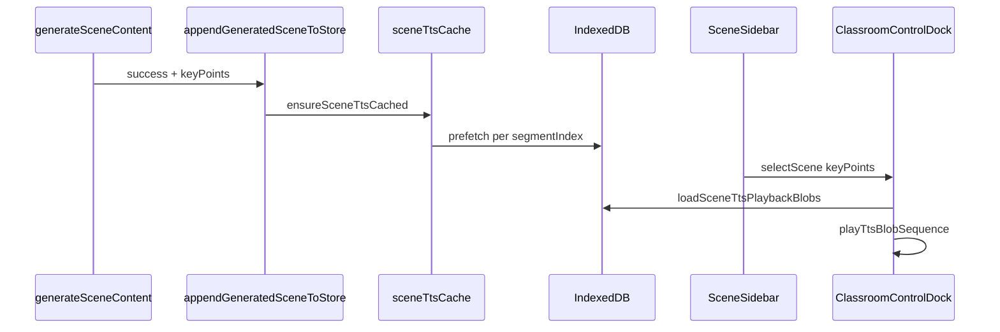

# PR: 重构 generation-preview → classroom + 讲解 TTS 本地缓存

---

## PR Summary（复制到 GitHub）

- generation-preview 仅流式生成大纲并跳转 classroom；场景内容在 classroom 从 index 0 顺序 `generateSceneContent`
- 侧边栏仅展示已生成场景；底部一条 pending loading（`generatingIndex === scenes.length`），无跳号
- 场景生成成功后按 `keyPoints` 预合成 TTS 写入 IndexedDB（Dexie `sceneTtsSegments`）
- 新增 `ClassroomControlDock`：音色选择、讲解气泡、按 keyPoints 顺序播放（**播放只读 IndexedDB，不实时调合成接口**）
- 侧边栏点击场景同步 `playableKeyPoints` 到 Dock

### Test plan

- [ ] Home → generation-preview → classroom 全流程
- [ ] 刷新 classroom：sessionStorage 恢复已生成场景并继续队列
- [ ] 侧边栏 pending 标题与正在生成的 outline 一致
- [ ] 场景生成后 IndexedDB 段数 = keyPoints.length
- [ ] 侧边栏切换场景 → 气泡文案与播放列表更新
- [ ] 播放 0→n-1 顺序至结束；播放中点击停止
- [ ] 本地缓存未就绪时播放按钮 loading / 错误提示
- [ ] 换音色不触发 Dock 内重新合成（仅影响后续新生成场景预合成）

---

## 1. 背景与动机

### 当前问题

- [x] 在生成大纲后跳转到 classroom 时会把 generation-preview 的全部大纲显示为侧边栏空卡片

**根因**：`applyInitialGeneratedScene()` 通过 `scenesFromStreamOutlines` 预建全部 outline 对应 scene，仅首个有内容。

- [x] generation-preview 承担首场景生成 + store 初始化，与 classroom 通过 sessionStorage/Pinia 隐性耦合

### 期望目标

- [x] 大纲就绪后跳转 classroom；未生成场景不占位，顺序请求直至完成
- [x] 侧边栏：场景 N 完成后才出现卡片；仅底部一条「场景 N+1 生成中」loading，不跳号
- [x] 讲解按大纲 `keyPoints` 分段预缓存，播放从 IndexedDB 按索引顺序播放

---

## 2. 改动后的目标流程

```
Generation Preview（/generation-preview）
  │ 大纲就绪 → saveClassroomOutlineCache（仅 outlines）
  │         → enterClassroom → /classroom/:id

Classroom（/classroom/:id）
  │ useSequentialSceneGeneration:
  │   restore cached generatedScenes → appendScene
  │   否则 generateSceneAtIndex → appendGeneratedSceneToStore
  │        └─ scheduleSceneTtsPrefetch（keyPoints → IndexedDB）
  │
  │ SceneSidebar 点击 → selectScene(keyPoints) → dockPlayableKeyPoints
  │ ClassroomControlDock 播放 → loadSceneTtsPlaybackBlobs → playTtsBlobSequence
```

### 关键数据通道

| 通道 | 用途 | 文件 |
|------|------|------|
| `sessionStorage` — `classroomStreamInput` | 编排起点参数 | `src/utils/classroomStream.ts` |
| `sessionStorage` — `classroomOutlineCache` | 大纲、已生成场景元数据 | `src/utils/classroomStream.ts` |
| Pinia `stageStore` | Stage + Scenes 运行时 | `src/stores/stage.ts` |
| IndexedDB `sceneTtsSegments` | 每段 keyPoint 对应 MP3 Blob | `src/db/index.ts` v2、`src/utils/sceneTtsCache.ts` |
| `localStorage` — TTS 音色偏好 | 预合成默认 voice | `src/utils/ttsVoiceStorage.ts` |

---

## 3. 变更范围

### 3.1 涉及文件

| 文件 | 变更摘要 |
|------|----------|
| `src/views/generation_preview/index.vue` | 移除首场景生成，大纲就绪即跳转 |
| `src/views/class_room/index.vue` | 简化 onMounted；Dock + `dockPlayableKeyPoints` |
| `src/composables/useSequentialSceneGeneration.ts` | 从 index 0 顺序生成；`contentResponse` 传入 append |
| `src/utils/sceneContentGenerate.ts` | 增量 append；删除批量预建；TTS 预合成钩子 |
| `src/stores/stage.ts` | `initStageFromOutlines` + `appendScene` |
| `src/utils/classroomGenerationCache.ts` | 缓存规范化 |
| `src/views/class_room/components/SceneSidebar.vue` | `selectScene` 上报 keyPoints |
| `src/views/class_room/components/ClassroomControlDock.vue` | **新增** 底部控制区、播放、音色 |
| `src/utils/sceneTtsCache.ts` | **新增** IDB 读写与预合成 |
| `src/utils/sceneKeyPoints.ts` | **新增** keyPoints 解析 |
| `src/utils/ttsPlayback.ts` | **新增** 单段/顺序播放 |
| `src/api/models/tts.ts` | **新增** voices / synthesize |
| `src/db/index.ts` | v2：`sceneTtsSegments` 表 |
| `src/assets/icons/*.svg` | Dock 图标资源 |
| `PR_OUTLINE.md` | 本文档 |

### 3.2 不变的部分

- Home `startClassroom`、SSE 流式大纲协议
- `generateSceneContent` API 契约
- `ScenePreview`、`RoomHeader` 主预览结构

---

## 4. 具体改动点（实现状态）

### 4.1 generation-preview：移除首场景生成

- [x] `onOutlinesReady()` 仅 `saveOutlineCacheOnReady` + 跳转 classroom
- [x] 移除 `generatingFirstScene` 与首场景 API 调用
- [x] `continueWithSavedOutlines` 有 outline 即跳转

### 4.2 stageStore：增量追加

- [x] `initStageFromOutlines` 只初始化 Stage，不预建 scenes
- [x] `appendScene` 按 order 更新/追加，`activate` 更新 `currentSceneId`
- [x] 移除 `loadFromOutlineCache` / `mergeFirstScene` / `initStageWithGeneratedScenes` 批量逻辑

### 4.3 useSequentialSceneGeneration

- [x] 从 `nextSceneIndex`（默认 0）顺序生成；先 `restoreCachedScenesToStore`
- [x] 缓存命中同步 append 不设 `generatingIndex`
- [x] API 前设 `generatingIndex`，返回后清空；`append` 后 `nextTick`

### 4.4 sceneContentGenerate

- [x] 删除 `applyInitialGeneratedScene` / `applyFirstSceneToStore`
- [x] `appendGeneratedSceneToStore` + `scheduleSceneTtsPrefetch`
- [x] `generateSceneAtIndex` 返回 `{ generated, contentResponse }`

### 4.5 classroom 页

- [x] 初始化交给 composable；可选 `db.classrooms` hydrate
- [x] 无 cache 时 `sceneInitError` 引导回首页（无 demo 兜底）

### 4.6 缓存清理

- [x] `firstScene` deprecated 字段清理（`classroomGenerationCache`）
- [ ] 全部 scene 完成后清除 sessionStorage（可选，未做）

### 4.7 侧边栏 pending loading

- [x] `showPendingLoading`：`generatingIndex === sortedScenes.length`
- [x] 稳定 scene id / order；`activate: true` 跟随当前生成场景

---

## 5. 课堂讲解语音（TTS + IndexedDB）



| 环节 | 说明 |
|------|------|
| 写入时机 | `appendGeneratedSceneToStore` → `ensureSceneTtsCached` → `prefetchSceneTtsSegments`（`POST /api/tts/synthesize`，**仅场景生成后**） |
| 存储 | Dexie v2 `sceneTtsSegments`，id = `classroomId::sceneId::segmentIndex` |
| 要点来源 | `resolveKeyPointsFromGeneration`（effectiveOutline → outline → generated.content） |
| 播放 | `loadSceneTtsPlaybackBlobs` 按 `playableKeyPoints.length` 顺序取 Blob；**Dock 内不调合成 API** |
| 列表同步 | Sidebar `selectScene` → `index.vue` `dockPlayableKeyPoints` → `v-model:playable-key-points` |

**本地 DB 升级**：已有 v1 `openmaic-mvp` 会自动 migration 到 v2；异常时可清站点数据后重试。

---

## 6. ClassroomControlDock

- 场景序号、上一场景/下一场景、倍速占位、聊天、全屏占位
- TTS 音色：`GET /api/tts/voices`，`Teleport` 弹层，`localStorage` 持久化
- 讲解气泡：展示当前 keyPoint 或首条要点；播放中随 `segmentIndex` 切换文案
- 播放按钮：loading（预写入 IDB）、音律跳动动画（`prefers-reduced-motion` 降级）
- 图标：`SvgIcon` + `src/assets/icons/*`
- **换音色**：仅保存偏好，不在 Dock 内对当前场景重新合成（follow-up：按新音色重刷 IDB）

---

## 7. 风险与测试

### 7.1 回归点

- [ ] Home → generation-preview → classroom
- [ ] outlineStatus `done` / `generating` 继续路径
- [ ] classroom 刷新恢复 sessionStorage + 继续生成队列
- [ ] 场景 1 完成、场景 2 请求中：侧边栏 1 张卡片 + 底部场景 2 loading
- [ ] TTS：生成后 IDB 段数与 keyPoints 一致；侧边栏切换后播放正确场景
- [ ] 播放顺序至结束；中途停止
- [ ] IDB 未就绪：loading 与「本地暂无讲解语音」提示

### 7.2 边界情况

- [ ] outlines 为空
- [ ] 单场景 outline
- [ ] 生成中途刷新 → 恢复后继续
- [ ] 生成中途切换侧边栏场景 → 后台队列不中断
- [ ] Dexie v1 → v2 升级后旧课堂 TTS 需重新预合成

### 7.3 已知限制

- `npm run typecheck` 存在与本次无关的历史 TS 报错（SvgIcon、theme 等），未在本 PR 内全部修复

---

## 8. 实施记录（develop 分支）

| 阶段 | 状态 |
|------|------|
| stageStore 增量 | 已完成 |
| sceneContentGenerate 精简 | 已完成 |
| useSequentialSceneGeneration index 0 | 已完成 |
| generation-preview 仅大纲 | 已完成 |
| classroom + Dock + TTS IDB | 已完成 |
| PR 文档 | 已完成 |

---

## 9. 备注

- TTS 预合成使用 `loadTtsVoicePreference()` 或默认 `zh-CN-XiaoxiaoNeural`
- `useSequentialSceneGeneration` 导出 `generating`、`generatingIndex`、`generatingSceneTitle` 等供 UI 使用
